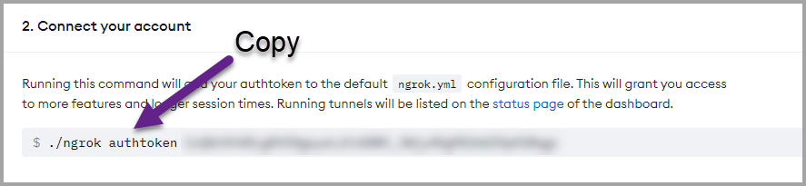

<style>
@import url('https://fonts.googleapis.com/css2?family=Prompt:ital,wght@0,100;0,300;0,400;0,700;1,100;1,300;1,400;1,700&display=swap');

:root {
    font-family: Prompt;
    --hl-color: #D57E7E;
}

h1 {
  font-family: Prompt;
}
</style>

# Production Supporting Systems in Factories

## ระบบสนับสนุนการผลิตในโรงงานอุตสาหกรรม

---

# Topic

- อุปกรณ์ตรวจวัดอัจฉริยะ
- ระบบสารสนเทศ
- **Industrial Control System (ICS)**
  - SCADA (Supervisory control and data acquisition)
  - DCS (Distributed control systems)

---

# SCADA

Supervisory control and data acquisition

---

# SCADA

- A system of software and hardware elements that allows industrial organizations to:
  - **Control** industrial processes locally or at remote locations
  - Directly **interact** with devices such as sensors, valves, pumps, motors, and more through human-machine interface (HMI) software
  - **Monitor**, gather, and process real-time data
  - **Record** events into a permanent storage.

---

# Architecture


- **PLC** (Programmable Logic Controller) and/or **RTU** (Remote Terminal Units)
- **HMI** (Human Machine Interface)
- **Field devices** - sensors and actuators
- **SCADA computer**

---

# We will come back to this topic later.

- Now, let's learn about a control system by making a DIY "SCADA".

---

# Project Demo

https://prod-sup.herokuapp.com/ui

---

# Diagram

[Link](https://drive.google.com/file/d/1W_3oIMGO2jK7o13aoHfsz1Yf2D-AcAIl/view?usp=sharing)

---

# Components

- `Node-Red App` running on a cloud server (Heroku Cloud)
  - Collect sensor data
  - Displaying sensor data
  - Notifying operator of the incident through `Line App` (on a desktop computer)
  - Writing and reading from `Database` (on Google Firestore)

---

# Components (cont)

- `Node-Red App` runnign on mobile
  - Receive command to toogle a `flashlight`
  - Process and send `accelerometer` data
- `Mosquitto App` running on a cloud server (Google VM)
  - Receiving and broadcasting data from and to both `Node-Red App`.

---

# Protocol

- HTTP (Hypertext Transfer Protocol)
  - Basically the "internet" protocol
- MQTT (MQ Telemetry Transport)
  - Leading open source protocol for connecting internet of things (IoT) and **industrial IoT (IIoT)** devices.

---

# Comparison to SCADA components

| Component           | Function            | SCADA Equiv.   |
| ------------------- | ------------------- | -------------- |
| `Node-Red` (Heroku) | Collect data        | PLC / RTU      |
|                     | Display data        | SCADA computer |
|                     | Notify to `Line`    | SCADA computer |
|                     | Write to `Database` | SCADA computer |

---

# Comparison to SCADA components

| Component           | Function             | SCADA Equiv. |
| ------------------- | -------------------- | ------------ |
| `Node-Red` (Mobile) | Control sensors      | PLC / RTU    |
| `Accelerometer`     | Measure acceleration | Sensor       |
| `Flashlight`        | Light                | Actuator     |

---

# Enough talk. Let's get started.

---

# Module 1-1: Setting up `Node-Red`

- Install [Node.js](https://nodejs.org/en/)
- Install [Visual Studio Code](https://code.visualstudio.com/)

---

- Change default terminal in `VSCode` (Windows only)
  - Open a window
  - Select `terminal` -> `New Terminal`
  - press `ctrl` + `p`
  - Type `> Terminal: Select Default Profile` and click
  - Select `cmd`

---

- Install `Node-Red`
  - Create a new folder
  - Drag a folder into `VSCode`
  - Select `terminal` -> `New Terminal`
  - (Terminal) `npm init -y`
  - (Terminal) `npm install node-red`
  - Create a directory called `local`

---

- Configure `Node-Red`
  - Click at the file `package.json` to edit
  - Add this line `"start": "npx node-red -u ./local -p 1880"`

```json
{
  // ...
  "scripts": {
    "test": "echo \"Error: no test specified\" && exit 1",
    // Add a new line here
    // Don't forget to add the extra "," above.
    "start": "npx node-red -u ./local -p 1880"
  }
  // ...
}
```

---

- Start `Node-Red`
  - (Terminal) `npm start`
- Visit the web browser at
  - `http://127.0.0.1:1880` or
  - `http://localhost:1880`

---

# Module 1-2: Navigating around `Node-Red`

Create flows to

- Show timestamp in the `debug` panel.
- Show date and time using `function` node. (See code on the other page.)
- Send continuous random numbers. (Use `Math.random()`)
- Use `switch` and `change`.

---

```javascript
const payload = msg.payload;
const date = new Date(payload);
msg.payload = date.toDateString();
return msg;
```

---

# Module 1-3: HTTP `Get` Request

- Send a `get` request to `http://google.com`.
- Display a response to a `debug` panel.
- Write a response to `index.html`

---

# Module 1-4: HTTP Server

- Create a server that responds to the `GET` request to `/hello`.
  - Respond with a static string.
  - Respond with a dynamic string.

```javascript
const date = new Date();
msg.time = date.toLocaleTimeString();
return msg;
```

---

- Reponse to `/home` with an HTML document.
  - Create flow `http in`, `read file`, `http response`, `debug`


---

- `http response` node

## 

---

# Module 1-5: Public server

- Get `ngrok`
  - Create an account at https://ngrok.com/
  - Download the program.
  - Extract the program to the project folder.
  - Copy the command below.



---

- `VSCode`
  - Create `New Terminal`
  - Run `ngrok authtoken <YOUR AUTHTOKEN>` (Remove `./` from what you just copied.)
  - Run `ngrok http 1880`
- Copy the address (`ctrl` + `shift` + `c`)


---

- Paste the address in the browser.
  - Don't forget to add the url in the end.

## 

- Try sharing this link to your friends.
