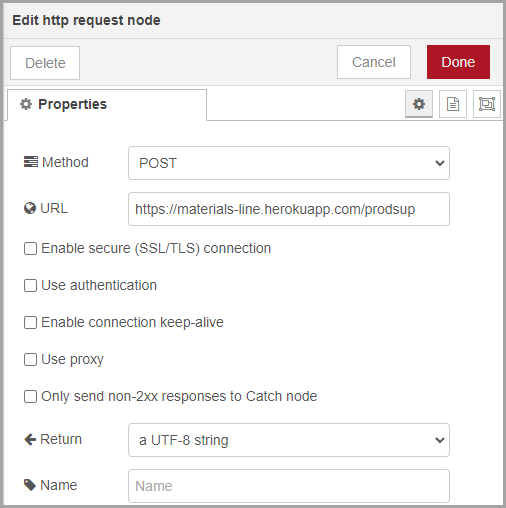

<style>
@import url('https://fonts.googleapis.com/css2?family=Prompt:ital,wght@0,100;0,300;0,400;0,700;1,100;1,300;1,400;1,700&display=swap');

:root {
    font-family: Prompt;
    --hl-color: #D57E7E;
}

h1 {
  font-family: Prompt;
}
</style>

# Production Supporting Systems in Factories

## ระบบสนับสนุนการผลิตในโรงงานอุตสาหกรรม

---

# Module 2-1: HTTP POST Server

---

# Server listening to `POST` requests

- Create a server that receives `POST` requests.
  - Flow


---

- `http in` node


- Send the transformed message back.
- Try sending the post requests to your friends public address.

---

- `template` node


---

- `http response` node


---

# Send `POST` request from `node-red`

---

- Create a `post` request
  - Flow


---

- `inject` node


---

# Send `POST` request from another program

---

# Software

- [Postman Desktop](https://www.postman.com/downloads/)
- Chrome
  - [Advancd REST Client](https://chrome.google.com/webstore/detail/advanced-rest-client/hgmloofddffdnphfgcellkdfbfbjeloo)
- Firefox
  - [RESTClient](https://addons.mozilla.org/en-US/firefox/addon/restclient/)

---

# Serving dynamic content

---

- Create another url that response with dynamic content.
  - Flow


- `http in` node
  - `url` = `post2`

---

- `function` node


(code on the next page)

---

```javascript
const message = msg.payload;
const date = new Date();
const time = date.toLocaleTimeString();

msg.payload = `I got your message "${message}" at ${time} !`;
return msg;
```

---

- Try send in a post message to `.../post2`.
- Also try sending a post message to your friend's public address.

---

# Class Attendance

## การทำเรื่องง่ายๆให้มันยาก

---

# วิธีการเช็คชื่อ

- Send `Post` request to https://materials-line.herokuapp.com/prodsup
- Payload
  - `cmu_id`: your 9-digit student id
  - `code`: 4-character code from the screen (ไม่เอา `CODE:`)

```json
{
  "cmu_id": "111222333",
  "code": "xxxx"
}
```

---

- Flow


---

- `inject` node
  - `msg.payload`


---

- `http request` node



---

# Module 2-2: Line Notify

---

- สร้างกลุ่ม LINE ภายใน Group
- ไปที่ https://notify-bot.line.me/en/
  - Login (need to verify number on smart phone)
  - Go to `My page`
  - Click `Generate token`
  - Enter `Token Name` and select a chat room.
  - Copy the token and store it somewhere.

---

- Let send a line notification through `Node-Red`

  - Flow
    

---

- `inject` node


---

- Set `msg.payload` to (JSON)

```JSON
{
  "message":"Hello"
}
```


---

- Set `msg.headers` to (JSON)

```JSON
{
  "Content-Type": "application/x-www-form-urlencoded",
  "Authorization": "Bearer <<YOUR LINE TOKEN>>"
}
```


---

- `http request` node
  - Method: `POST`
  - URL: `https://notify-api.line.me/api/notify`

---


---

- Add `debug` node to see the output.
  - You can inspect the error.
- Try injecting to see if the notification.

---

# Extra

- Make a server that send the message to `Line`.
  - The message comes from the `POST` request.
