<style>
@import url('https://fonts.googleapis.com/css2?family=Prompt:ital,wght@0,100;0,300;0,400;0,700;1,100;1,300;1,400;1,700&display=swap');

:root {
    font-family: Prompt;
    --hl-color: #D57E7E;
}

h1 {
  font-family: Prompt;
}
</style>

# Production Supporting Systems in Factories

## ระบบสนับสนุนการผลิตในโรงงานอุตสาหกรรม

---

# Smart Sensors

---

# Smart sensors

- A smart sensor is a device that

  - takes input from the physical environment
  - perform predefined functions upon detection of specific input
  - then process data before passing it on.

- Your mobile phone running `Node-Red` can be programmed to be very **smart** sensors.

---

# Module 4-1: Mobile sensors

---

- Use `Node-Red` from a mobile phone.
- Flow
  - `inject`, `exec`, `debug`, `mqtt out`

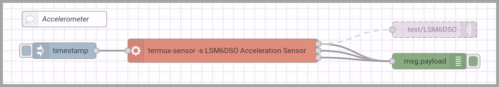

---

- `exec` node
  - `Command`: `termux-sensor -s LSM6DSO Acceleration Sensor`
    - _Your sensor name will be different._
  - `Output`: `while the command is running ....`

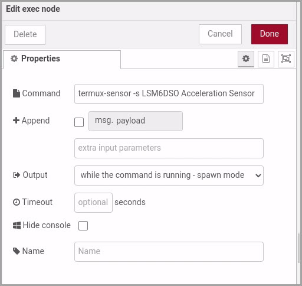

---

- `mqtt out` node
  - `Server`: Create new server similar to M3-1
  - `Topic`: `test/LSM6DSO`
    - _Your topic will be different._
  - `QoS`: `1`
    

---

- Resetting sensors

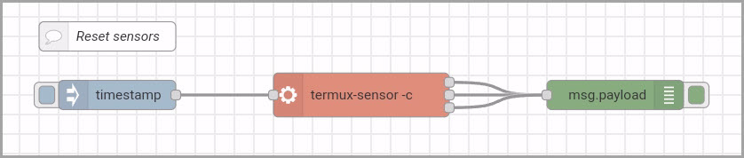

---

- `exec` node
  - `Command`: `termux-sensor -c`
  - `Output`: `when the command is complete ...`
    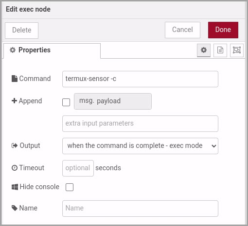

---

# Module 4-2: Sensor Subscriber

---

- Use `Node-Red` from your computer
- Flow
  - `mqtt in`, `json`, `function`, `debug`

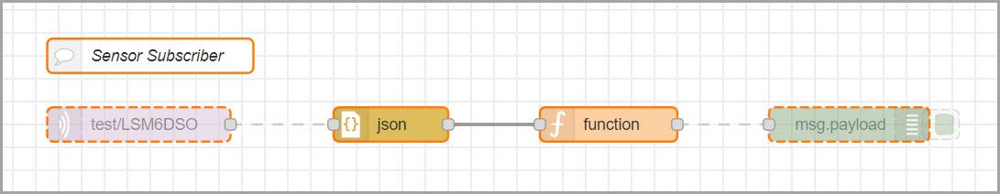

---

- `mqtt in` node
  - `Topic`: `test/LSM6DSO`
  - `QoS`: `1`
    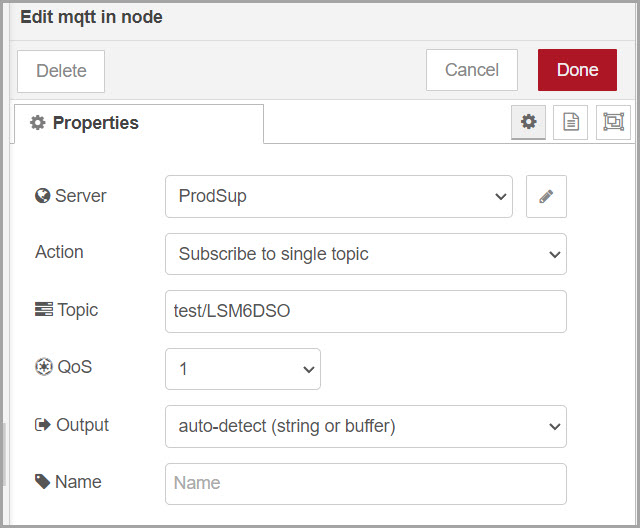

---

- `json` node
  - No need to adjust anything.
    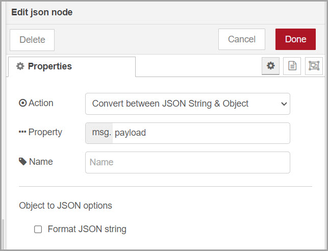

---

- `function` node (code on the next page)


---

```javascript
const payloadJSON = msg.payload;
const values = payloadJSON['LSM6DSO Acceleration Sensor'].values;
const norm = Math.sqrt(values[0] ** 2 + values[1] ** 2 + values[2] ** 2);
msg.payload = norm;
return msg;
```

---

# Module 4-3: Fake sensors

---

- If you cannot use a mobile phone to send sensor data, you can create a fake sensor data from `Node-Red` in your computer.
- Flow
  - `inject`, `function`, `mqtt out`
    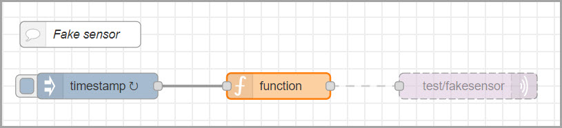

---

- `inject` node
  - `Repeat`: every 1 second
    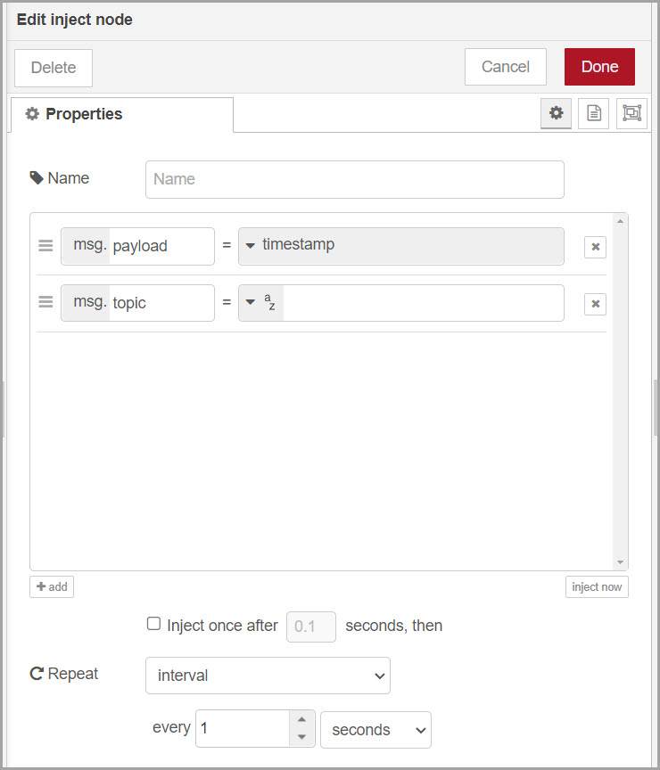

---

- `function` node

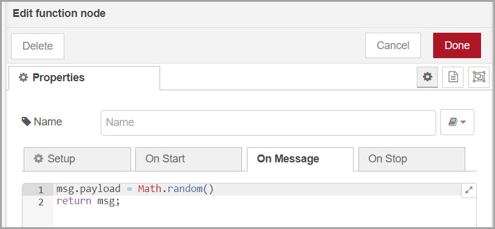

---

```javascript
msg.payload = Math.random();
return msg;
```

---

- `mqtt out` node
  - `Topic`: `test/fakesensor`
  - `QoS`: `1`
    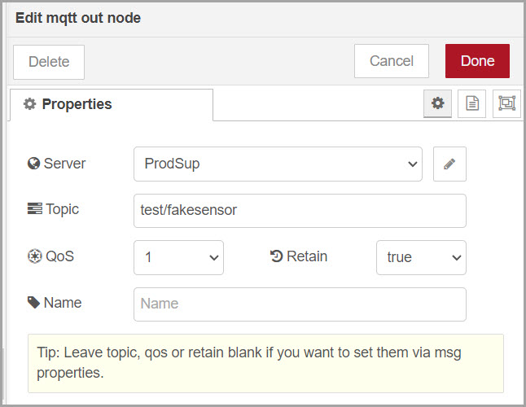

---

- Lastly, we can listen to the sensors.
- Flow
  - `mqtt in`, `function`, `debug`
    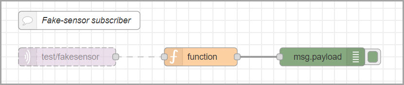

---

- `mqtt in` node
  - `Topic`: `test/fakesensor`
  - `QoS`: `1`
    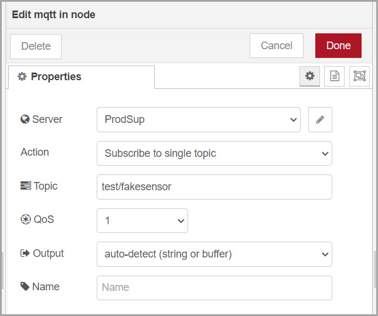

---

- `function` node

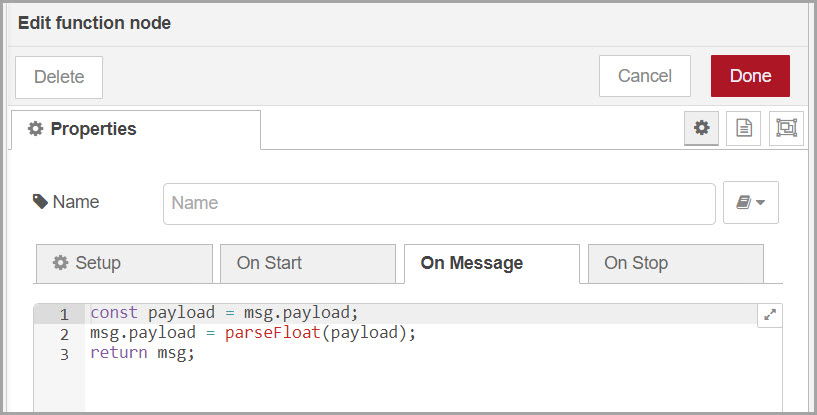

---

```javascript
const payload = msg.payload;
msg.payload = parseFloat(payload);
return msg;
```
